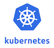

---

<!-- omit from toc -->
# Terraform Hands-on Repository

- A collection of Hands-on labs for Terraform.
- Each lab is a standalone lab and does not require to complete the previous labs.

---


[](https://console.cloud.google.com/cloudshell/editor?cloudshell_git_repo=https://github.com/nirgeier/TerraformLabs)

<!-- omit from toc -->
### **<kbd>CTRL</kbd> + click to open in new window**

---
<!-- omit from toc -->
### Requirements

| Kubernetes                   | Terraform                          | Comments                                                                                               |
| ---------------------------- | ---------------------------------- | ------------------------------------------------------------------------------------------------------ |
|  |  | :white_check_mark: &nbsp; A running K8S cluster <br/>:white_check_mark: &nbsp; Terraform pre installed |

<!-- inPage TOC start -->

---
<!-- omit from toc -->
## Lab Highlights:
- [Terraform CLI Docs - `terraform plan`](#terraform-cli-docs---terraform-plan)
  - [Notes](#notes)
- [01. Plan without changes](#01-plan-without-changes)
- [01.02. Output changes](#0102-output-changes)

---

<!-- inPage TOC end -->

### Terraform CLI Docs - `terraform plan`

Docs: [https://www.terraform.io/docs/cli/commands/plan.html](https://www.terraform.io/docs/cli/commands/plan.html)

#### Notes

- One of the most usefully and important commands
- The `terraform plan` command creates an execution plan.
- By default, creating a plan consists of:
  - Reading the current state of any already-existing remote objects to make sure that the Terraform state is up-to-date.
  - Comparing the current configuration to the prior state and noting any differences.
  - Proposing a set of change actions that should, if applied, make the remote objects match the configuration.
- The `plan` command alone will not actually carry out the proposed changes, and so you can use this command to check whether the proposed changes match what you expected before you apply the changes or share your changes with your team for broader review.
- If Terraform detects that no changes are needed to resource instances or to root module output values, terraform plan will report that no actions need to be taken.

---

### 01. Plan without changes

- If terraform see no changes the output is pretty straightforward

```sh
# Execute plan on empty folder or no changes
terraform plan

No changes. Your infrastructure matches the configuration.
```

### 01.02. Output changes

- In case of changes the output will display the changes with a `+` and `-` sign
- For our demo we will try to create a k8s namespace.
- In order to be able to work with localhost we need to set the `kubeapi` port so terraform will be able to use it.

```sh
# Set the desired port for kubeapi.
# This port will be set under the kubernetes provider
# We will set the same port in the main.tf as well (34567 in this sample)
kubectl proxy --port=34567 --address='0.0.0.0' --accept-hosts='^.*' &
```

- The sample `main.tf`

```sh
# Add the kubernetes provider
provider "kubernetes" {
  # Set the minikbue context
  # Tell Terraform that we are running our cluster under minikube.
  config_context_cluster = "minikube"

  # Set the path to the kubeconfig
  config_path = "~/.kube/config"

  # We need to set this port or the import might fail
  # This is the same port as we defined for the proxy few lines above
  host = "http://localhost:34567"
}

# Define a "New" namespace resource
resource "kubernetes_namespace" "codewizard_namespace" {

  # Set the desired namespace
  metadata{
    name = "codewizard"
  }
}
```

- The output of the plan now will be:

```hcl
$ terraform plan

Terraform used the selected providers to generate the following execution plan.
Resource actions are indicated with the following symbols:
  + create

Terraform will perform the following actions:

  # kubernetes_namespace.codewizard_namespace will be created
  + resource "kubernetes_namespace" "codewizard_namespace" {
      + id = (known after apply)

      + metadata {
          + generation       = (known after apply)
          + name             = "codewizard"
          + resource_version = (known after apply)
          + uid              = (known after apply)
        }
    }

Plan: 1 to add, 0 to change, 0 to destroy.
```

<!-- navigation start -->

---

<div align="center">
:arrow_left:&nbsp;
  <a href="../01.03-validate">01.03-validate</a>
&nbsp;&nbsp;||&nbsp;&nbsp;  <a href="../01.05-apply">01.05-apply</a>
  &nbsp;:arrow_right:</div>

---

<div align="center">
  <small>&copy;CodeWizard LTD</small>
</div>
<!-- navigation end -->