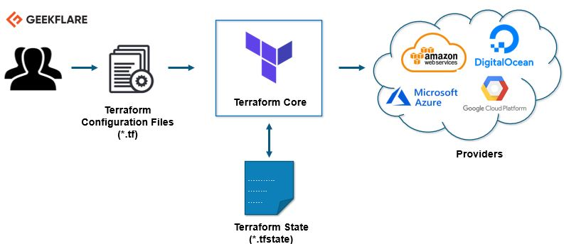
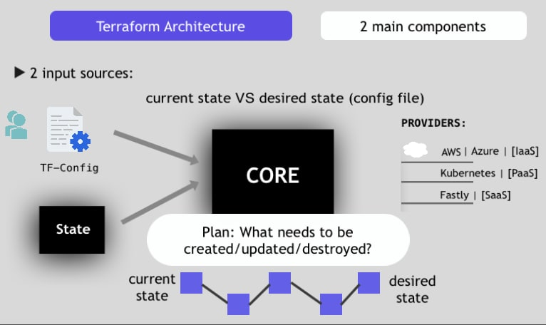

---

<!-- header start -->

<a href="https://stackoverflow.com/users/1755598/codewizard"></a>&emsp;&emsp;[](https://www.linkedin.com/in/nirgeier/)&emsp;[](mailto:nirgeier@gmail.com)&emsp;[](mailto:nirg@codewizard.co.il)

<!-- header end -->

---

<!-- omit from toc -->
# Terraform Hands-on Repository

- A collection of Hands-on labs for Terraform.
- Each lab is a standalone lab and does not require to complete the previous labs.

---


[](https://console.cloud.google.com/cloudshell/editor?cloudshell_git_repo=https://github.com/nirgeier/TerraformLabs)

<!-- omit from toc -->
### **<kbd>CTRL</kbd> + click to open in new window**

---

### Pre-Requirements

> This tutorial will walk you using terraform locally without any requirements for any cloud provider.  
> If you are using GCP all the tools are **pre-installed**

| Terraform                      | Kubernetes               | Minikube                      | Helm                      | kubectl                      |
| ------------------------------ | ------------------------ | ----------------------------- | ------------------------- | ---------------------------- |
|  |  |  |  |  |

| Tool          | Comments                                                                                                 |
| ------------- | -------------------------------------------------------------------------------------------------------- |
| K8S           | An existing cluster or any other local tool as described [here](https://kubernetes.io/docs/tasks/tools/) |
| **kubectl**   | The Kubernetes command-line tool, kubectl                                                                |
| **minikube**  | Local cluster for running the hands on labs                                                              |
| **Helm**      | Some of the demos will require helm charts installed                                                     |
| **Terraform** | This is what this tutorial is about ...                                                                  |

---

### What is Terraform?

- IAC - **I**nfrastructure **A**s **C**ode
- Open Source developed by HashiCorp
- Declarative language - Define **what** you want and terraform will "get" there, terraform will figure out how to create what you wish.
- Terraform is mainly for Infrastructure (IAC)
- Terraform is based upon modules

---

### Terraform Key Features

- #### Infrastructure as a Code

  - Infrastructure is described using a high-level configuration syntax with HCL files.
  - Due to the fact that HCL are text files they can be stores in SCM (GIT for example) in a branch level, this ability allow to share, reuse, versioned and more.

- #### Execution Plans

  - `terraform plan` generates an execution plan (JSON file).
  - Since this a text file (JSON) as mentioned above it can be stored in SCM (GIT for example) and can versioned, shared and more.
  - The execution plan calculate the "difference" between the current state to the desired state.
  - The plan describe exactly what `Terraform` will change and in what order which make it clear what will happen.

- #### Resource Graph

  - Terraform builds a graph of all your resources.
  - Terraform try to execute the required changes in parallel of any non-dependent resources.
  - `terraform graph` generate a `DOT` (DOT is a graph description language) files which can be converted to `svg` images for example.

  - ```
    # Generate a graph based upon the execution plan
    # require dot to be installed,

    ### MacOs
        brew install graphviz
    ### Linux
        sudo apt-get install graphviz

    terraform graph | dot -Tsvg > graph.svg
    ```

- #### Automation
  - Terraform as `IAC` (**Infrastructure as code**) tool, and as such it designed for making automated changes or with a minimal human interaction.
  - Terraform support using templates for re-use code. In this way we it support multiple environments, providers by writing a simple syntax.

---

### Terraform Architecture





- Terraform is build upon 2 main components:
  - Core
  - State
- User write the desired code, terraform calculate the desired result and execute it using the selected provider.
- In the following labs we will learn how to work with Terraform

---

- List of the labs in this repository:

<!-- Labs list start -->

:green_book: [00-Setup](Labs/00-Setup/README.md) 
### CLI commands 
> :green_book: [01-init](Labs/01.CLI/01.01-init/README.md)  
> :green_book: [02-get](Labs/01.CLI/01.02-get/README.md)  
> :green_book: [03-validate](Labs/01.CLI/01.03-validate/README.md)  
> :green_book: [04-plan](Labs/01.CLI/01.04-plan/README.md)  
> :green_book: [05-apply](Labs/01.CLI/01.05-apply/README.md)  
> :green_book: [06-destroy](Labs/01.CLI/01.06-destroy/README.md)  
> :green_book: [07-refresh](Labs/01.CLI/01.07-refresh/README.md)  
> :green_book: [09-import](Labs/01.CLI/01.09-import/README.md)  
> :green_book: [10-state](Labs/01.CLI/01.10-state/README.md)  
> :green_book: [11-workspace](Labs/01.CLI/01.11-workspace/README.md)  
> :green_book: [12-graph](Labs/01.CLI/01.12-graph/README.md)  
:green_book: [02-Variables](Labs/02-Variables/README.md)  
:green_book: [03-Getting-Started-Kubernetes](Labs/03-Getting-Started-Kubernetes/README.md)  
:green_book: [04-Getting-Started-Helm-Chart](Labs/04-Getting-Started-Helm-Chart/README.md)

---

:green_book: [00.00-Setup](Labs/00.00-Setup/README.md)

- [01. Install](Labs/00.00-Setup/README.md#01-Install)
  - [01.01. Install minikube](Labs/00.00-Setup/README.md#0101-Install-minikube)
  - [01.02. Install helm](Labs/00.00-Setup/README.md#0102-Install-helm)
  - [01.03. Install Terraform](Labs/00.00-Setup/README.md#0103-Install-Terraform)
- [02. Verify installation](Labs/00.00-Setup/README.md#02-Verify-installation)

:green_book: [01.00-CLI-Commands](Labs/01.00-CLI-Commands/README.md)

- [01. Terraform CLI](Labs/01.00-CLI-Commands/README.md#01-Terraform-CLI)
  - [01.01. Most common commands](Labs/01.00-CLI-Commands/README.md#0101-Most-common-commands)
  - [01.02. Additional Commands](Labs/01.00-CLI-Commands/README.md#0102-Additional-Commands)

:green_book: [01.01-init](Labs/01.01-init/README.md)

- [01. A bit about `init`](Labs/01.01-init/README.md#01-A-bit-about-init)
- [02. `terraform init -backend`](Labs/01.01-init/README.md#02-terraform-init--backend)
  - [02.01. What Backends Do?](Labs/01.01-init/README.md#0201-What-Backends-Do)
- [03. `terraform init -get -upgrade`](Labs/01.01-init/README.md#03-terraform-init--get--upgrade)
- [04. Working with plugins](Labs/01.01-init/README.md#04-Working-with-plugins)
- [05. Hands-On](Labs/01.01-init/README.md#05-Hands-On)

:green_book: [01.02-get](Labs/01.02-get/README.md)

- [01. Hand-On](Labs/01.02-get/README.md#01-Hand-On)
  - [01.01. Empty modules](Labs/01.02-get/README.md#0101-Empty-modules)
  - [01.02. With Modules](Labs/01.02-get/README.md#0102-With-Modules)

:green_book: [01.03-validate](Labs/01.03-validate/README.md)

- [01. Basic usage: `terraform validate`](Labs/01.03-validate/README.md#01-Basic-usage-terraform-validate)
- [02. output validation](Labs/01.03-validate/README.md#02-output-validation)
- [03. Usage](Labs/01.03-validate/README.md#03-Usage)
- [04. Hands-On](Labs/01.03-validate/README.md#04-Hands-On)

:green_book: [01.04-plan](Labs/01.04-plan/README.md)

- [01. Plan without changes](Labs/01.04-plan/README.md#01-Plan-without-changes)
  - [01.02. Output changes](Labs/01.04-plan/README.md#0102-Output-changes)

:green_book: [01.05-apply](Labs/01.05-apply/README.md)

- [01. Run `terraform apply`](Labs/01.05-apply/README.md#01-Run-terraform-apply)
- [02. Usage](Labs/01.05-apply/README.md#02-Usage)
- [03. Example](Labs/01.05-apply/README.md#03-Example)

:green_book: [01.06-destroy](Labs/01.06-destroy/README.md)

- [01. `terraform plan -destroy`](Labs/01.06-destroy/README.md#01-terraform-plan--destroy)
- [02. Execute `terraform plan / terraform plan -destroy`](Labs/01.06-destroy/README.md#02-Execute-terraform-plan--terraform-plan--destroy)

:green_book: [01.07-refresh](Labs/01.07-refresh/README.md)

- [01. `terraform refresh` without exiting resources](Labs/01.07-refresh/README.md#01-terraform-refresh-without-exiting-resources)
- [02. Refresh existing resource](Labs/01.07-refresh/README.md#02-Refresh-existing-resource)

<!-- Labs list ends -->

©CodeWizard LTD
