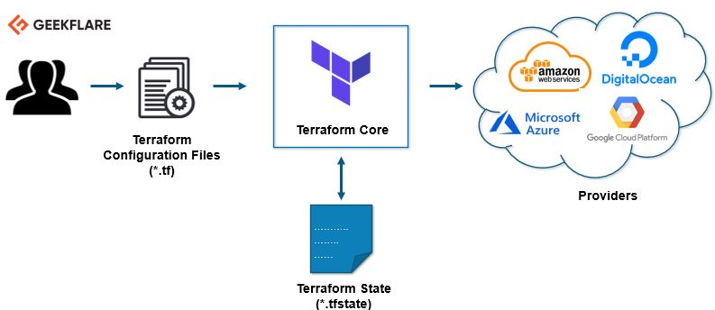
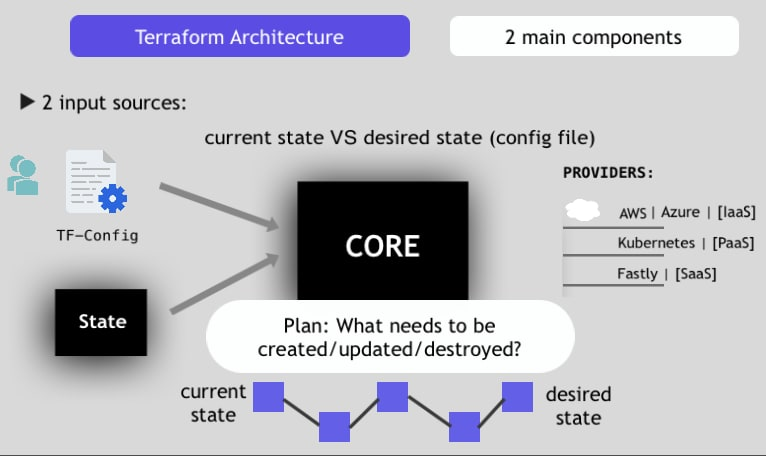

---

<!-- header start -->

&emsp;&emsp;&emsp;&emsp;

<!-- header end -->

---

# Terraform Hands-on Repository

- A collection of Hands-on labs for Terraform.
- Each lab is a standalone lab and does not require to complete the previous labs.

---

### **<kbd>CTRL</kbd> + click to open in new window**

---

### Pre-Requirements

> **This tutorial will walk you using terraform locally without any requirements for any cloud provider.**  
> **If you are using GCP all the tools are pe-installed**03-output-validation

- An existing cluster or any other local tool as described [here](https://kubernetes.io/docs/tasks/tools/)
  - **kubectl** - The Kubernetes command-line tool, kubectl
  - **minikube** - Local cluster for running the hands on labs
  - **Helm** - Some of the demos will require helm charts installed
  - **Terraform** - This is what this tutorial is about ...

---

### What is Terraform?

- IAC - **I**nfrastructure **A**s **C**ode
- Open Source developed by HashiCorp
- Declarative language - Define **what** you want and terraform will "get" there, terraform will figure out how to create what you wish.
- Terraform is mainly for Infrastructure (IAC)
- Terraform is based upon modules

### Terraform Architecture

- Terraform is build upon 2 main components:
  - Core
  - State
- User write the desired code, terraform calculate the desired result and execute it using the selected provider.
- In the following labs we will learn how to work with Terraform

---

- List of the labs in this repository:

<!-- Labs list start -->
:green_book: [00.00-Setup](Labs/00.00-Setup/README.md)  
:green_book: [01.00-CLI-Commands](Labs/01.00-CLI-Commands/README.md)  
:green_book: [01.01-init](Labs/01.01-init/README.md)  
:green_book: [01.02-get](Labs/01.02-get/README.md)  
:green_book: [01.03-validate](Labs/01.03-validate/README.md)  
:green_book: [01.04-plan](Labs/01.04-plan/README.md)  
:green_book: [01.05-apply](Labs/01.05-apply/README.md)  
:green_book: [01.06-destroy](Labs/01.06-destroy/README.md)  
:green_book: [01.07-refresh](Labs/01.07-refresh/README.md)  
:green_book: [01.08-workspace](Labs/01.08-workspace/README.md)  
:green_book: [01.09-state](Labs/01.09-state/README.md)  
:green_book: [02.00-Getting-Started-Kubernetes](Labs/02.00-Getting-Started-Kubernetes/README.md)  
:green_book: [03.00-Getting-Started-Helm-Chart](Labs/03.00-Getting-Started-Helm-Chart/README.md)  
:green_book: [04.00-Terraform-Import](Labs/04.00-Terraform-Import/README.md)  
:green_book: [05.00-Variables](Labs/05.00-Variables/README.md)

---

:green_book: [00.00-Setup](Labs/00.00-Setup/README.md)
- [01. Install](Labs/00.00-Setup/README.md#01-Install)
  - [01.01. Install minikube](Labs/00.00-Setup/README.md#0101-Install-minikube)
  - [01.02. Install helm](Labs/00.00-Setup/README.md#0102-Install-helm)
  - [01.03. Install Terraform](Labs/00.00-Setup/README.md#0103-Install-Terraform)
- [02. Verify installation](Labs/00.00-Setup/README.md#02-Verify-installation)

:green_book: [01.00-CLI-Commands](Labs/01.00-CLI-Commands/README.md)
- [01. Terraform CLI](Labs/01.00-CLI-Commands/README.md#01-Terraform-CLI)
  - [01.01. Most common commands](Labs/01.00-CLI-Commands/README.md#0101-Most-common-commands)
  - [01.02. Additional Commands](Labs/01.00-CLI-Commands/README.md#0102-Additional-Commands)

:green_book: [01.01-init](Labs/01.01-init/README.md)
- [01. A bit about `init`](Labs/01.01-init/README.md#01-A-bit-about-init)
- [02. `terraform init -backend`](Labs/01.01-init/README.md#02-terraform-init--backend)
  - [02.01. What Backends Do?](Labs/01.01-init/README.md#0201-What-Backends-Do)
- [03. `terraform init -get -upgrade`](Labs/01.01-init/README.md#03-terraform-init--get--upgrade)
- [04. Working with plugins](Labs/01.01-init/README.md#04-Working-with-plugins)
- [05. Hands-On](Labs/01.01-init/README.md#05-Hands-On)

:green_book: [01.02-get](Labs/01.02-get/README.md)
- [01. Hand-On](Labs/01.02-get/README.md#01-Hand-On)
  - [01.01. Empty modules](Labs/01.02-get/README.md#0101-Empty-modules)
  - [01.02. With Modules](Labs/01.02-get/README.md#0102-With-Modules)

:green_book: [01.03-validate](Labs/01.03-validate/README.md)
- [01. Basic usage: `terraform validate`](Labs/01.03-validate/README.md#01-Basic-usage-terraform-validate)
- [02. output validation](Labs/01.03-validate/README.md#02-output-validation)
- [03. Examples](Labs/01.03-validate/README.md#03-Examples)
- [04. Hands-On](Labs/01.03-validate/README.md#04-Hands-On)

:green_book: [01.04-plan](Labs/01.04-plan/README.md)
- [01. Outputs](Labs/01.04-plan/README.md#01-Outputs)
  - [02.02. No changes](Labs/01.04-plan/README.md#0202-No-changes)
  - [01.02. Output changes](Labs/01.04-plan/README.md#0102-Output-changes)

:green_book: [01.05-apply](Labs/01.05-apply/README.md)
- [01. Run `terraform apply`](Labs/01.05-apply/README.md#01-Run-terraform-apply)
- [02. Usage](Labs/01.05-apply/README.md#02-Usage)

:green_book: [01.06-destroy](Labs/01.06-destroy/README.md)
- [01. `terraform plan -destroy`](Labs/01.06-destroy/README.md#01-terraform-plan--destroy)
- [02. Execute `terraform destroy`](Labs/01.06-destroy/README.md#02-Execute-terraform-destroy)

:green_book: [01.07-refresh](Labs/01.07-refresh/README.md)
- [01. `terraform refresh` without exiting resources](Labs/01.07-refresh/README.md#01-terraform-refresh-without-exiting-resources)
- [02. Refresh existing resource](Labs/01.07-refresh/README.md#02-Refresh-existing-resource)
- [03. Create a change](Labs/01.07-refresh/README.md#03-Create-a-change)
- [04. Refresh the changes](Labs/01.07-refresh/README.md#04-Refresh-the-changes)
- [05. View the changes](Labs/01.07-refresh/README.md#05-View-the-changes)

:green_book: [01.08-workspace](Labs/01.08-workspace/README.md)
- [01. `terraform workspace`](Labs/01.08-workspace/README.md#01-terraform-workspace)
- [02. Create workspace](Labs/01.08-workspace/README.md#02-Create-workspace)
- [03. Switch to workspace](Labs/01.08-workspace/README.md#03-Switch-to-workspace)
- [04. Use workspace names](Labs/01.08-workspace/README.md#04-Use-workspace-names)
- [05. Use workspace as condition](Labs/01.08-workspace/README.md#05-Use-workspace-as-condition)
- [06. Usage:](Labs/01.08-workspace/README.md#06-Usage)

:green_book: [01.09-state](Labs/01.09-state/README.md)
- [01. `terraform.tfstate`](Labs/01.09-state/README.md#01-terraformtfstate)
- [02. `terraform show`](Labs/01.09-state/README.md#02-terraform-show)
- [03. State commands](Labs/01.09-state/README.md#03-State-commands)

:green_book: [02.00-Getting-Started-Kubernetes](Labs/02.00-Getting-Started-Kubernetes/README.md)
- [01. Getting started](Labs/02.00-Getting-Started-Kubernetes/README.md#01-Getting-started)
- [02. Terraform module](Labs/02.00-Getting-Started-Kubernetes/README.md#02-Terraform-module)
- [03. Your first Terraform module](Labs/02.00-Getting-Started-Kubernetes/README.md#03-Your-first-Terraform-module)
  - [03.01. Add provider](Labs/02.00-Getting-Started-Kubernetes/README.md#0301-Add-provider)
  - [03.02. Add namespace](Labs/02.00-Getting-Started-Kubernetes/README.md#0302-Add-namespace)
  - [03.03. Execute terraform](Labs/02.00-Getting-Started-Kubernetes/README.md#0303-Execute-terraform)

:green_book: [03.00-Getting-Started-Helm-Chart](Labs/03.00-Getting-Started-Helm-Chart/README.md)
- [01. Getting started](Labs/03.00-Getting-Started-Helm-Chart/README.md#01-Getting-started)
  - [01.01. Create `main.tf`](Labs/03.00-Getting-Started-Helm-Chart/README.md#0101-Create-maintf)
- [02. Adding terraform code](Labs/03.00-Getting-Started-Helm-Chart/README.md#02-Adding-terraform-code)
  - [02.01. Add provider `kubernetes`](Labs/03.00-Getting-Started-Helm-Chart/README.md#0201-Add-provider-kubernetes)
  - [02.02. Add provider `helm`](Labs/03.00-Getting-Started-Helm-Chart/README.md#0202-Add-provider-helm)
  - [02.03. Add namespace](Labs/03.00-Getting-Started-Helm-Chart/README.md#0203-Add-namespace)
  - [02.04. Add the helm chart resource](Labs/03.00-Getting-Started-Helm-Chart/README.md#0204-Add-the-helm-chart-resource)
- [03. Run terraform](Labs/03.00-Getting-Started-Helm-Chart/README.md#03-Run-terraform)
  - [03.01. terraform init](Labs/03.00-Getting-Started-Helm-Chart/README.md#0301-terraform-init)
  - [03.02. terraform validate](Labs/03.00-Getting-Started-Helm-Chart/README.md#0302-terraform-validate)
  - [03.04. terraform plan](Labs/03.00-Getting-Started-Helm-Chart/README.md#0304-terraform-plan)
  - [03.03. terraform apply](Labs/03.00-Getting-Started-Helm-Chart/README.md#0303-terraform-apply)
- [04. Verify that all resources have been created](Labs/03.00-Getting-Started-Helm-Chart/README.md#04-Verify-that-all-resources-have-been-created)
- [05. Cleanup](Labs/03.00-Getting-Started-Helm-Chart/README.md#05-Cleanup)

:green_book: [04.00-Terraform-Import](Labs/04.00-Terraform-Import/README.md)
- [01. Getting started](Labs/04.00-Terraform-Import/README.md#01-Getting-started)
  - [01.02. Set the `kubeapi` port](Labs/04.00-Terraform-Import/README.md#0102-Set-the-kubeapi-port)
  - [01.03. Set the `kubernetes` provider](Labs/04.00-Terraform-Import/README.md#0103-Set-the-kubernetes-provider)
- [02. Import the namespace](Labs/04.00-Terraform-Import/README.md#02-Import-the-namespace)
  - [02.01. Add the missing configuration](Labs/04.00-Terraform-Import/README.md#0201-Add-the-missing-configuration)
  - [02.02. Try to import again](Labs/04.00-Terraform-Import/README.md#0202-Try-to-import-again)
  - [02.03. Check the import](Labs/04.00-Terraform-Import/README.md#0203-Check-the-import)
- [03. Modify the namespace](Labs/04.00-Terraform-Import/README.md#03-Modify-the-namespace)
  - [03.01. Add label to the namespace](Labs/04.00-Terraform-Import/README.md#0301-Add-label-to-the-namespace)
  - [03.01. Remove the existing resource form terraform](Labs/04.00-Terraform-Import/README.md#0301-Remove-the-existing-resource-form-terraform)
  - [03.02. Import again to view changes](Labs/04.00-Terraform-Import/README.md#0302-Import-again-to-view-changes)
  - [03.02. Verify changes](Labs/04.00-Terraform-Import/README.md#0302-Verify-changes)
- [04. `Terraform refresh`](Labs/04.00-Terraform-Import/README.md#04-Terraform-refresh)
  - [04.01. Load the changes](Labs/04.00-Terraform-Import/README.md#0401-Load-the-changes)
  - [04.02. Review changes](Labs/04.00-Terraform-Import/README.md#0402-Review-changes)
- [05. Cleanup](Labs/04.00-Terraform-Import/README.md#05-Cleanup)

:green_book: [05.00-Variables](Labs/05.00-Variables/README.md)
- [01. Getting started](Labs/05.00-Variables/README.md#01-Getting-started)
  - [01.01. Create the main file](Labs/05.00-Variables/README.md#0101-Create-the-main-file)
  - [01.02. Set the `kubeapi` port](Labs/05.00-Variables/README.md#0102-Set-the-kubeapi-port)
- [02. Define variable](Labs/05.00-Variables/README.md#02-Define-variable)
  - [02.01. Input variables](Labs/05.00-Variables/README.md#0201-Input-variables)
<!-- Labs list ends -->

©CodeWizard LTD
